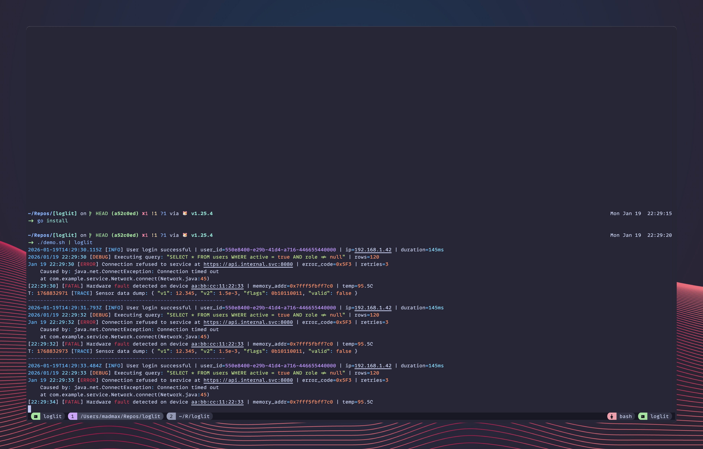

# Loglit

Loglit is a powerful CLI tool designed to make log analysis easier by adding syntax highlighting to your logs in the terminal. It supports a wide range of built-in patterns and allows for custom regex highlighting.



## Features

- **Syntax Highlighting**: Automatically highlights common log elements:
  - **Log Levels**: ERROR, WARN, INFO, DEBUG, TRACE, FATAL, etc.
  - **Dates & Times**: RFC3339, YYYY-MM-DD, MM/DD, durations (e.g., `10s`, `50ms`).
  - **Numbers**: Integers, floats, hex, binary, octal.
  - **Network**: IPv4, IPv6, MAC addresses, URLs.
  - **Identifiers**: UUIDs, MD5/SHA hashes.
  - **Code Elements**: Boolean, null, strings, paths.
- **Input Flexibility**: Reads from standard input (stdin) or files.
- **Custom Patterns**: Highlight specific terms or patterns using regex arguments.
- **Output Handling**: Writes the primary output to stdout, or to the file named by `--output`. A colored terminal peek is shown on another TTY when the primary output is not a terminal.

## Installation

```bash
go install github.com/madmaxieee/loglit@latest
```

## Usage

### Basic Usage

By default, loglit writes its primary output to stdout. When stdout is not a terminal, it can also show a colored "peek" on stderr while keeping stdout suitable for piping:

```bash
tail -f app.log | loglit > clean_logs.txt
```

Use `--no-peek` to disable the terminal peek. `--color=auto` colors stdout only when stdout is a terminal; `--color=always` and `--color=never` force the primary stdout color. Output written with `--output` is always uncolored, while its peek (if a terminal is available) is always colored.

Read directly from a file:

```bash
loglit -i application.log
```

### Custom Highlighting

You can provide additional regex patterns as arguments to highlight them specifically (defaults to a bold/highlighted style):

```bash
# Highlight "connection timeout" and specific error codes
loglit "connection timeout" "ERR-\d+" -i app.log
```

## Acknowledgments

- [log-highlight.nvim](https://github.com/fei6409/log-highlight.nvim) - Inspiration for built-in patterns and highlighting styles.
- [tokyonoight.nvim](https://github.com/folke/tokyonight.nvim) - Color scheme inspiration.
